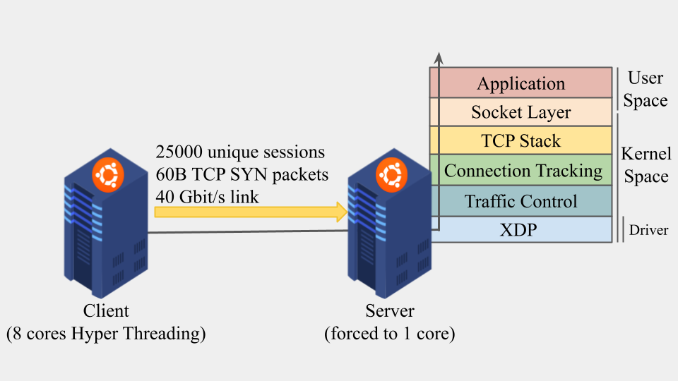

<!-- markdown-link-check-disable -->

<!-- markdown-link-check-enable -->

# Opportunistic Network Monitoring

Research project on opportunistic network traffic monitoring.

For credits, please reference [this](https://doi.org/10.1109/ACCESS.2022.3202644) publication:

*S. Magnani, F. Risso and D. Siracusa, "A Control Plane Enabling Automated and Fully Adaptive Network Traffic Monitoring With eBPF," in IEEE Access, vol. 10, pp. 90778-90791, 2022, doi: 10.1109/ACCESS.2022.3202644.*

## Installation

This project requires [DeChainy](https://github.com/dechainers/dechainy) to be correctly set up in you system, either bare-metal or using containers. For performance reasons, we preferred the bare-metal installation, whoch can be installed by following [this](https://github.com/dechainers/dechainy/blob/master/docs/installation.md#local) guide.

The following requirement is *matplotlib* for creating charts.

Concerning the eBPF programs, you must have a recent Linux kernel >= v5.6, since some tests use BPF_QUEUEs which have been recently introduced.

Finally, for the tests that require network traffic to be sent, the client requires a working build of [MoonGen](https://github.com/emmericp/MoonGen) under the home directory of the user used for the tests. Please refer to their guide for installing and setting up the correct driver for your network interface.

## Project Structure

```bash
.
├── adaptiveness
│   ├── ebpf.c
│   ├── __init__.py
│   └── __main__.py
├── erase
│   ├── ebpf.c
│   ├── __init__.py
│   └── __main__.py
├── nprobe
│   ├── ebpf.c
│   ├── __init__.py
│   └── __main__.py
└── swap
│   ├── ebpf.c
│   ├── __init__.py
│   └── __main__.py
├── moongen.lua
├── plotter.ipynb
└── set_irq_affinity.sh
```

* **adaptiveness**: Test case, containing an eBPF probe for measuring the impact of having a non-adaptive (nProbe), adaptive (pre-defined list of possibilities), and fully-adaptive solution
* **erase**: Test case, containing an eBPF probe for measuring the impact of some populate-erase operations on eBPF maps, including their most recent optimized versions (batch operations)
* **nprobe**: Test case, containing an eBPF probe for measuring the impact of extracting the exact information extracted from nProbe within eBPF, in terms of number of processed packets and memory used
* **swap**: Test case, containing an eBPF probe for measuring the impact of requesting a snapshot-access to the eBPF maps, both in terms of compilation time and performance degradation while swapping in-out the underlying eBPF programs.
* **moongen.lua**: used by the client to generate traffic at line rate using MoonGen
* **plotter.ipynb**: a Python notebook for plotting the results of the tests leveraging matplotlib
* **set_irq_affinity.sh**: a Bash script for setting the number of CPU used for handling incoming network traffic to 1 for a specific interface

## Assumptions



This figure represents the set-up used for the tests, and the following assumptions have been made:

1. Server is the machine that receives network traffic and runs eBPF probes
1. Server supports XDP_DRV mode. Change it in the *\_\_main__.py* files of the desired test
1. Client-Server have their ssh keys registered under the home folder of the user used for logging-in.
1. Client has a working MoonGen build under the following directory `~/Moongen/build`. Change it if needed.

## Usage

To run one of the tests between the available ones (*adaptiveness*, *erase*, *nprobe*, *swap*):

1. go to the root of the project (the current directory)
1. `python -m <test_name> --help` to read the available arguments
1. `python -m <test_name> ...` to run the test with the provided arguments

A result file will be available once finished.

## Acknowledgements

If you are using OpportunisticMonitoring's code for a scientific research, whether to replicate experiments or try new ones, please cite the related paper in your manuscript as follows:

`S. Magnani, F. Risso and D. Siracusa, "A Control Plane Enabling Automated and Fully Adaptive Network Traffic Monitoring With eBPF," in IEEE Access, vol. 10, pp. 90778-90791, 2022, doi: 10.1109/ACCESS.2022.3202644.`

I sincerely thank my Ph.D. advisor Domenico Siracusa, and my M.Sc. thesis supervisor prof. Fulvio Risso.
